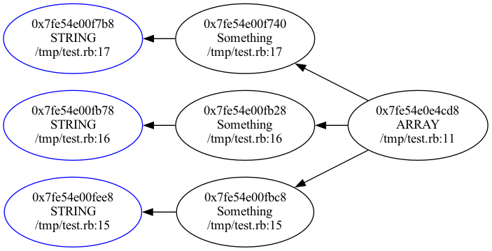

HeapLeak
========

This is a tool for finding the reason for a leak in a Ruby application. To use it, you'll want to grab 3 captures of the Ruby heap using `ObjectSpace.dump_all` (they can be gzipped). Those should ideally be taken after processing one iteration of some action. If you can reproduce the leak in a test script, it could be:

```ruby
3.times {
  some_action
  GC.start
  ObjectSpace.dump_all
}
```

or if you're capturing the state in production, you could do it in a handler after processing a request / job / iteration / ...

Now that you have heaps A, B, C, the assumption is that they should contain the same objects (+/- caching and other details) and anything else is objects allocated while processing a request/job and should have been freed.

That means objects in heap B which did not exist in heap A (baseline), but still exist in heap C are likely the ones being leaked. The list of those objects can be found using:

```
$ heapleak stats heap_1 heap_2 heap_3
Potentially leaked objects:
DATA: 1783
  0x560a5b066790 0x560a5b4a9438 ...
STRING: 3666
  0x560a5b06aa70 0x560a5b2f49f8 ...
HASH: 1783
  0x560a5b06aac0 0x560a5b06ea80 ...
ActiveModel::Attribute::FromDatabase: 54
  0x560a60cc2548 0x560a60cc2b10 ...
(...)
```

This is a summary of the leaked objects. You can select a type which looks most suspicious to you and copy the list of addresses where those objects are found. To find the relations between those objects and what are the common objects holding the reference to them run: (at least 2 sample addresses needed)

```
$ heapleak root heap_2 0x560a60cc2548 0x560a60cc2b10 0x560a60cfa858
```

This will give you a `dot` diagram of the connections, hopefully pointing away from the object which holds the unexpected references. You can render it as an image with:

```
dot -Tpng -o output.png output.dot
```

This should produce a diagram like this:



The initial selected "leaked" objects are marked with blue colour.
